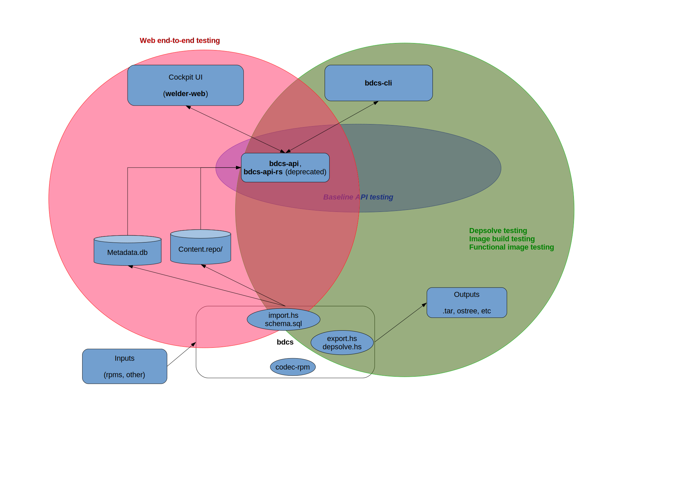

This is your starting place for the Welder project!

Quick links
-----------

| *Repo name* | *CI status* | *Coverage*  | *Documentation* |
|---------------------------------------------------|---|---|---|
| [bdcs](https://github.com/weldr/bdcs) |  |  |   |
| [bdcs-api](https://github.com/weldr/bdcs-api) |  |  |   |
| [bdcs-cli](https://github.com/weldr/bdcs-cli) |  |  |   |
| [bdcs-api-rs](https://github.com/weldr/bdcs-api-rs) |  |  |   |
| [codec-rpm](https://github.com/weldr/codec-rpm) |  |  |   |
| [content-store](https://github.com/weldr/content-store) |  |  |   |
| [welder-web](https://github.com/weldr/welder-web) |  |  |   |
| [lorax-composer](https://github.com/rhinstaller/lorax) |  |  |   |

Test organization
-----------------

Each of the components above is part of the Welder project. For each one of them we have

* Unit tests written in the respective programming language of the component, usually Haskell;
* Basic sanity tests for stand-alone programs, cli tools, etc. These tests cover things like
  exit codes, input sanitation and basic operations of the program (as long as the environment
  is easy to setup). Such tests are usually written in Bash script using
  [Beakerlib](https://github.com/beakerlib/beakerlib/).

*NOTES:*

- Where possible execute these in Travis CI and collect code coverage;
- It is possible to execute the tests inside docker containers;
- Strive for high coverage number!

Then we have three (3) distinctive groups of integration tests:

1. Web end-to-end tests (in red above): these exercise the UI and execute inside Docker
   container. The environment needs the backend API server and actual data to work
   properly. However we use a small subset of the real input data because it is only needed
   so that the API layer can start properly.

2. Depsolve and image output testing (in green above): the goal of these tests is to make sure
   our depsolving layer actually works and make sure the resulting OS images work!
   - Depsolving:
     - sanity check Welder's depsolver output
     - compare Welder's depsolver output to dnf(yum)
     - benchmark the two
     - **NOTE:** ATM depsolving uses metadata.db from CentOS 7. The goal is to create this DB by
       importing a package set depsolved by dnf/yum and compare the results between the two!
       This will also help prevent breakages due to async SQL schema or metadata.db updates!
   - Image build testing:
     - sanity check the resulting images, e.g. do we have a bootloader for ISO images (not done ATM);
     - fire up functional tests for the chosen recipe and image type. Currently we spin-up
       Docker containers and verify that the expected software is there, e.g. if I'm testing the
       *http-server* recipe then I expect something to be listening on port 80 and serving files!
       These tests are written in Bash script and will be migrated to Beakerlib! Due to specific
       requirements for testing the various image types (bare metal install, Docker, VM, etc) testing
       will be executed in various environments (e.g. Beaker) and the results will be aggregated.

3. API baseline test suite (in blue above, doesn't exist ATM): the goal of this test suite is to assure we're
   notified of every change in the API which may break the front-end components. This test suite
   is a record-and-compare type of suite (using Python & Betamax) where known responses are
   stored under git and compared to the current response!

*NOTES:*

- All of the integration test suites need to send their test result status back to GitHub!
  It is best to set test status on a PR and on the main branch used for develpment! This
  will help us know if we're going to break something!

Test trigerring
---------------

Our CI environment needs to execute the following tests against PRs and branch commits:

* codec-rpm: unit tests;
* welder-web: unit tests and web e2e tests;
* bdcs-cli: unit & basic sanity tests, the depsolve test suite, the image build test suite.
  Both depsovle and image build suites are part of the bdcs-cli repository;
* bdcs: unit & basic sanity tests
  - trigger web e2e tests
  - trigger depsolve and image build suites
  - **NOTE:** Use commit hash or PR number to distinguish bdcs artifacts (import/export versions)
    from the ones coming from the latest build on master branch!
* bdcs-api: unit & basic sanity tests, API baseline test suite (part of this repository)
  - trigger web e2e tests
  - trigger depsolve and image build suites
  - **NOTE:** use versioning to make sure the API backend used in the other test suites
    is the one which triggered the execution

API baseline test outline
--------------------------

Using
[Betamax](https://betamax.readthedocs.io/en/latest/integrations.html#unittest-integration)
we can create the following structure:

1. Run tests, issuing GET/POST requests as necessary: `record_mode=once`, `match=(method, url, json_body)`;
   This will create only one record per cassette;
2. in `setUpClass` json.load all existing cassettes;
3. in `tearDown` compare the current cassette (response answer) to the previous one and
   raise exception if different!

**NOTES:**

- all cassetes (e.g. good known responses) are stored in git
- in case of failure we need to manually overwrite with the new baseline!

RHEL 7 notes
------------

`lorax-composer` will provide the backend portion instead of the various `bdcs*` components.
`lorax-composer` will be integrated with `yum` so there won't be `metadata.db` and the content
store will be the yum repositories configured on the system.

* Web end-to-end tests will have lorax-composer as their backend API layer. This is already
  modular (Docker container) so just swap the layers! Nothing else changes;
* Baseline API test suite will be part of lorax-composer;
  - when API changes we need to trigger web end-to-end tests with the appropriate API version;
* Depsolve and image build testing will use lorax cli and be part of lorax-composer;

**NOTE:** All docker images used in testing must be based on RHEL 7 when testing the
lorax-composer integration!
