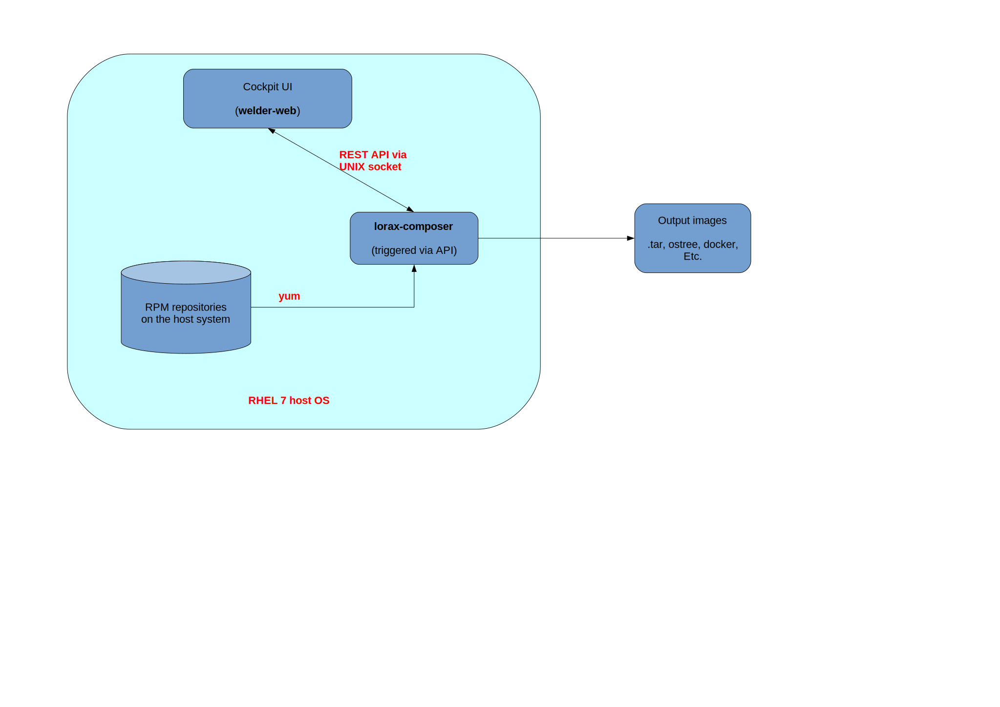

This is your starting place for the Welder project!

Quick links
-----------

| *Repo name* | *CI status* | *Coverage*  | *Documentation* |
|---------------------------------------------------|---|---|---|
| [bdcs](https://github.com/weldr/bdcs) |  |  |   |
| [bdcs-api](https://github.com/weldr/bdcs-api) |  |  |   |
| [bdcs-cli](https://github.com/weldr/bdcs-cli) |  |  |   |
| [bdcs-api-rs](https://github.com/weldr/bdcs-api-rs) |  |  |   |
| [codec-rpm](https://github.com/weldr/codec-rpm) |  |  |   |
| [content-store](https://github.com/weldr/content-store) |  |  |   |
| [welder-web](https://github.com/weldr/welder-web) |  |  |   |
| [lorax-composer](https://github.com/rhinstaller/lorax) |  |  |   |

Test organization
-----------------

Each of the components above is part of the Welder project. For each one of them we have

* Unit tests written in the respective programming language of the component, usually Haskell;
* Basic sanity tests for stand-alone programs, cli tools, etc. These tests cover things like
  exit codes, input sanitation and basic operations of the program (as long as the environment
  is easy to setup). Such tests are usually written in Bash script using
  [Beakerlib](https://github.com/beakerlib/beakerlib/).

*NOTES:*

- Where possible execute these in Travis CI and collect code coverage;
- Execute the tests inside docker containers with the latest Fedora version;
- Strive for high coverage number!

Then we have two distinctive groups of integration tests:

1. Web end-to-end tests (in red above): these exercise the UI and execute inside Docker
   container. The environment needs the backend API server and actual data to work
   properly. All the necessary data is created(imported) during test setup.

2. Depsolve and image output testing (in green above): the goal of these tests is to make sure
   our depsolving layer actually works and make sure the resulting OS images work!
   - Depsolving:
     - sanity check Welder's depsolver output
     - compare Welder's depsolver output to dnf
     - benchmark the two
     - **NOTE:** the required metadata.db is imported during test setup!
   - Image build testing:
     - sanity check the resulting images, e.g. do we have a bootloader for ISO images (not done ATM);
     - fire up functional tests for the chosen recipe and image type. Currently we spin-up
       Docker containers and verify that the expected software is there, e.g. if I'm testing the
       *http-server* recipe then I expect something to be listening on port 80 and serving files!
       These tests are written in Bash script with Beakerlib! Due to specific
       requirements for testing the various image types (bare metal install, Docker, VM, etc) testing
       will be executed in various environments and the results should be aggregated as
       commit/pull request statuses in GitHub.

*NOTES:*

- All of the integration test suites need to send their test result status back to GitHub!
  It is best to set test status on a PR and on the main branch used for development! This
  will help us know if we're going to break something!

Test trigerring
---------------

Because some components depend on each other the wollowing external triggers should
be configured:

* **bdcs** - when new RPM package is published (to COPR):
  - trigger bdcs-api
  - trigger bdcs-cli
  - trigger welder-web

* **bdcs-api** - when new Docker container is pushed (to Docker HUB):
  - trigger web e2e tests
  - trigger depsolve and image build suites

* **codec-rpm** - when new cabal package is pushed to Hackage:
  - trigger bdcs

* **content-store** - when new cabal package is pushed to Hackage:
  - trigger bdcs

**IMPORTANT:** all failures caused by dependent components must be fixed ASAP
to avoid blocking the development process!

RHEL 7 notes
------------

`lorax-composer` will provide the backend portion instead of the various `bdcs*` components.
`lorax-composer` will be integrated with `yum` so there won't be `metadata.db` and the content
store will be the yum repositories configured on the system.

* Web end-to-end tests will have lorax-composer as their backend API layer and they will
  be executed via the Cockpit interface;
* When lorax-composer API changes we need to trigger web end-to-end tests with the appropriate version;
* There is no depsolve testing because this is done by yum;
* Image build testing will use lorax-composer API and is part of lorax-composer;

**NOTE:** All docker images used in testing must be based on CentOS 7 or RHEL 7 when testing the
lorax-composer integration!
